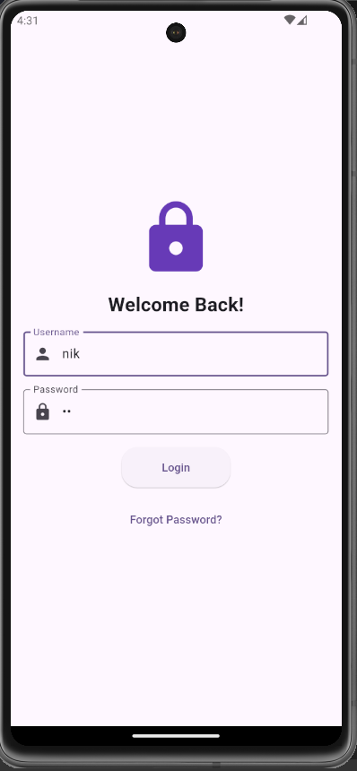
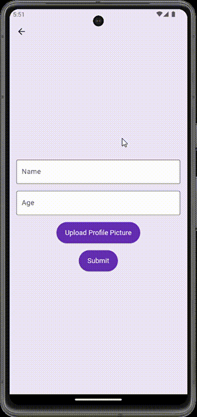

# Mobile App Dev Class 📱

## Assignment 1: Login Page 🔐

This assignment involves creating anything, so I created a **login page**.

---

## Assignment 2: Profile Page 📝

This assignment involves creating a **profile page** where users can enter their name, age, and upload a profile picture. The page displays the entered information and the uploaded profile picture.

